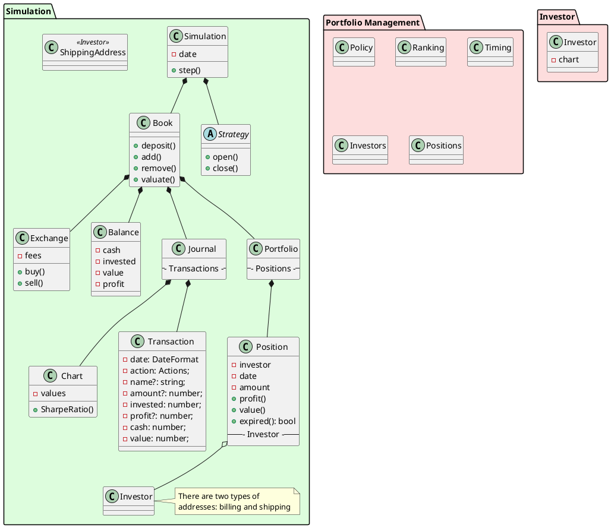

A diagram of classes for simulation

```puml
@startuml classes
package "Simulation" #DDFDDD {
    class Simulation {
        - date
        + step()
    }

    class Book {
        + deposit()
        + add()
        + remove()
        + valuate()
    }

    abstract class Strategy {
        + open()
        + close()
    }

    Simulation *-- Book
    Simulation *-- Strategy

    class Exchange {
        - fees
        + buy()
        + sell()
    }

    class Balance {
        - cash
        - invested
        - value
        - profit
    }

    class Journal {
        --- Transactions ---
    }

    class Portfolio {
        --- Positions ---
    }

    Book *-- Exchange
    Book *-- Balance
    Book *-- Journal
    Book *-- Portfolio

    class Position {
        - investor
        - date
        - amount
        + profit()
        + value()
        + expired(): bool
        --- Investor ---
    }


    Portfolio *-- Position
    Position o-- Investor

    class Chart {
        - values
        + SharpeRatio()
    }


    class Transaction {
        - date: DateFormat
        - action: Actions;
        - name?: string;
        - amount?: number;
        - invested: number;
        - profit?: number;
        - cash: number;
        - value: number;
    }

    Journal *-- Chart
    Journal *-- Transaction

    note right of Investor 
        There are two types of 
        addresses: billing and shipping
    end note


    class ShippingAddress <<Investor>>
}

package "Investor" #FDDDDD {
    class Investor {
        - chart
    }
}

package "Portfolio Management" #FDDDDD {
    class Policy {}
    class Ranking {}
    class Timing {}
    class Investors {}
    class Positions {}

}

@enduml
```
